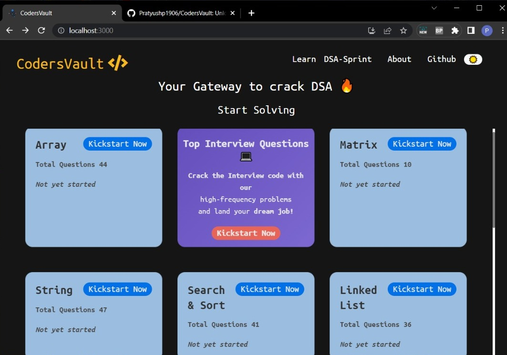

# CodersVault 💻

[](https://reactjs.org/)
[](https://450dsa.com/)

## Overview 👀



- **Topic wise question search 🔍**
- **Topic wise progress 🧐**
- **Complete local storage 📂**
- **Clean UI ⚡**

## What is CodersVault 🤔

#### CodersVault helps you elevate your DSA skills with expertly selected questions and playlists. Our user-friendly platform caters to all levels and offers feedback to ensure you grasp fundamental concepts.

#### CodersVault doesn't guarantee a job but guarantees your confidence in solving any coding problem if done in the right way 👍🏻.

## Dependencies 🗃

- [React] - **Frontend Framework**
- [Bootstrap] - **CSS Framework**
- [React-Reveal] - **React Based Animations**
- [React-Table-2] - **Suite of table hooks**
- [LocalBase] - **Firebase style DB for offline storage**

## WIP 🛠

- ~Dark Mode~
- ~Add `bookmark` feature~
- Leader Board
- Better Responsive CSS
- Better State Management

## Run Locally 💻

```
git clone https://github.com/AsishRaju/450-DSA.git
npm install
npm start
```

[](https://github.com/KumarPiyush852002/CodersVault)

## Credits 🙏🏻

#### _[DSA Cracker Sheet]_ by [Love Babbar]
#### _[A2Z DSA Course Sheet]_ by [Raj Vikramaditya]
#### _[DSA Sheet]_ by [Mohammad Fraz]
#### _[DSA Tracker]_ by [Arsh Goyal]

[here]: https://www.youtube.com/watch?v=4iFALQ1ACdA
[450dsa]: https://450dsa.com/
[love babbar]: https://www.linkedin.com/in/love-babbar-38ab2887/
[dsa cracker sheet]: https://drive.google.com/file/d/1FMdN_OCfOI0iAeDlqswCiC2DZzD4nPsb/view
[a2z dsa course sheet]:https://takeuforward.org/strivers-a2z-dsa-course/strivers-a2z-dsa-course-sheet-2/
[Raj Vikramaditya]:https://www.linkedin.com/in/rajarvp/
[dsa sheet]:https://leadcoding.in/dsa-sheet/
[dsa tracker]:https://docs.google.com/spreadsheets/d/1MGVBJ8HkRbCnU6EQASjJKCqQE8BWng4qgL0n3vCVOxE/edit#gid=0
[Mohammad Fraz]:https://www.linkedin.com/in/frazmohammad/
[Arsh Goyal]:https://www.linkedin.com/in/arshgoyal/
[localbase]: https://github.com/dannyconnell/localbase
[react-reveal]: https://www.react-reveal.com/
[bootstrap]: https://react-bootstrap.github.io/
[react]: https://reactjs.org/
[react-table-2]: https://react-bootstrap-table.github.io/react-bootstrap-table2/
